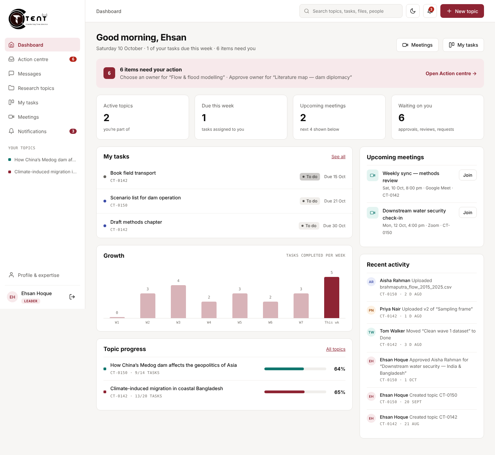
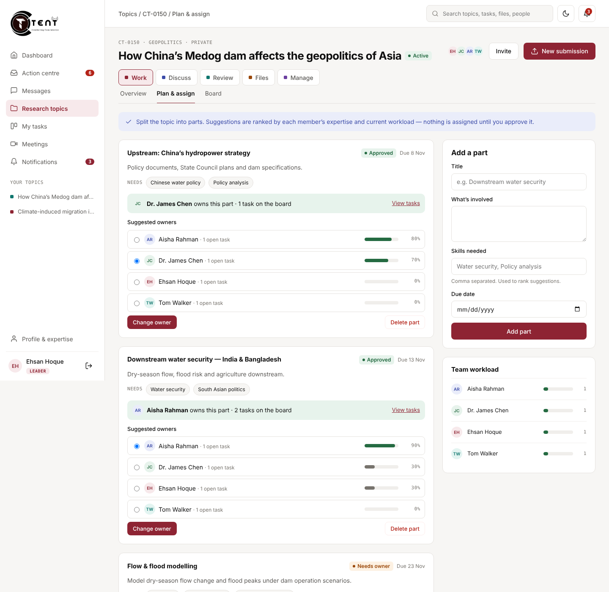
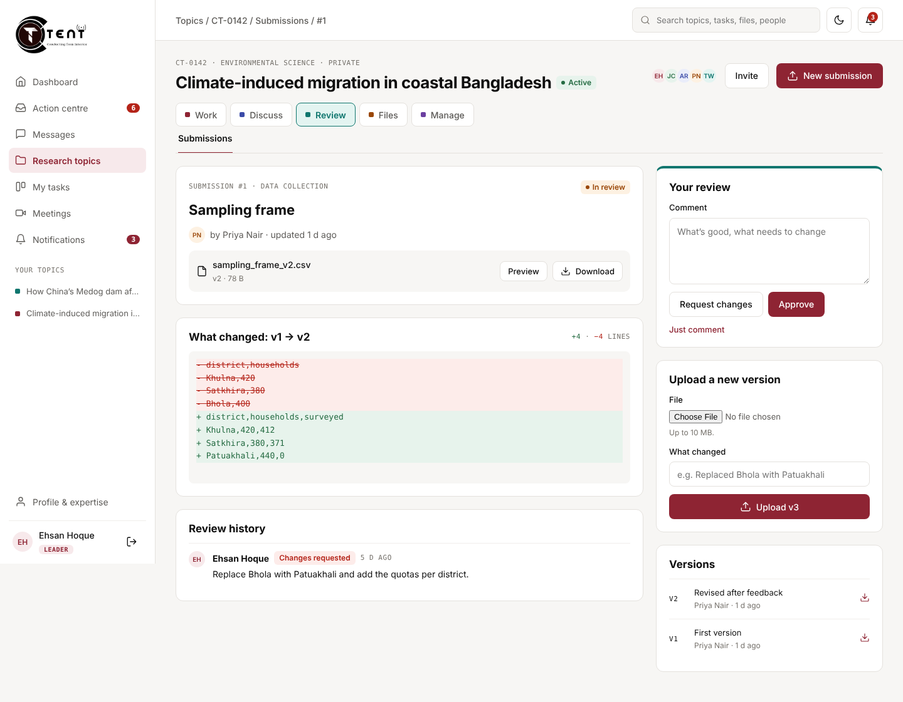
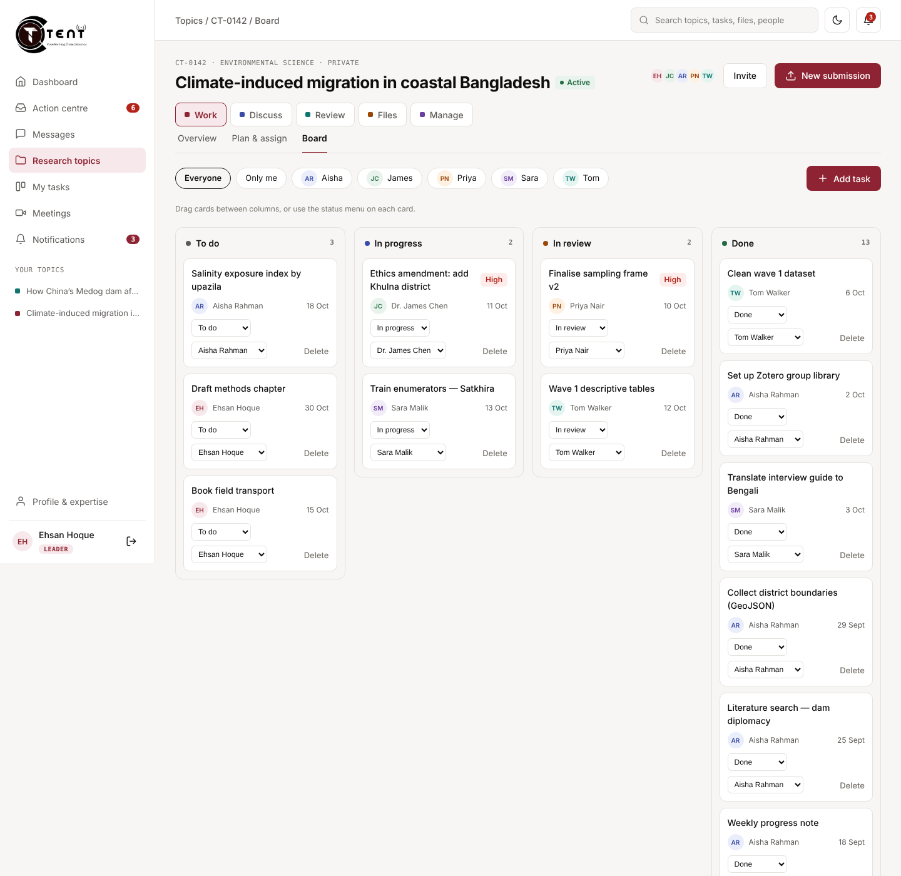
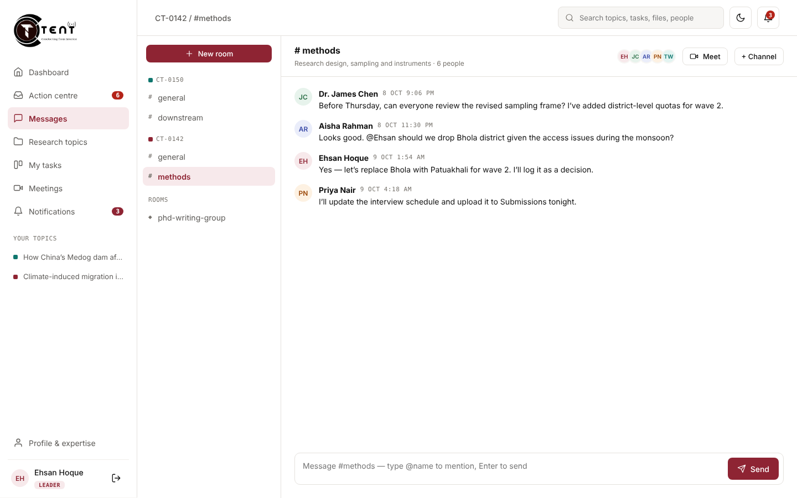

<p align="center"></p>

# CTENT — research group workspace

CTENT is a web app where a research group can create a research topic, split it into parts, have the leader approve who owns each part, discuss the work, meet, submit drafts for review and keep files together.

This is **version 0.1, the first working build** for partner feedback. It has a real database, sign-in and role-based access.



## Try it

The fastest way to see it is the hosted demo. Its link is shared separately once it's deployed; see [Deploy](#deploy-a-live-demo-on-render-free).

On the sign-in page, click any **demo account** to sign in as that person. Each one shows a different level of access:

| Account | Role | What they see |
|---|---|---|
| Nadia Karim | **Admin** | Everything, plus the admin console (users, roles, audit log) |
| Ehsan Hoque | **Leader** | Leads two topics; approves parts, reviews submissions, manages members |
| Dr. James Chen | **Leader** | Leads CT-0131 and is a member of other topics |
| Aisha Rahman, Priya Nair, Tom Walker, Sara Malik | **Member** | Only the topics they belong to |
| Rahul Mehta | **Member** | In no topics yet; has asked to join one |
| Dr. Lin Wei | **Guest** | External reviewer; read-only access to the overview, submissions and files |

Every demo account uses the password `demo1234`. Everyone trying the demo shares the same data.

## What works in this version

- **Sign-in and roles:** Admin > Leader > Member > Guest.
  - Members can't create topics and only see their own topics.
  - Guests only see what they've been given.
  - Admins see everything.
- **Topics:**
  - Create a topic from a template: journal paper, field study, policy analysis or grant application.
  - Topics can be private, institution-wide or open.
  - People can ask to join a topic, and the leader accepts or declines.
  - A topic can be archived (becomes read-only) or deleted.
- **Plan & assign:**
  - Split a topic into parts.
  - CTENT ranks members by matching their expertise to the part and checking their current workload.
  - **The leader approves the owner. Nothing is assigned automatically.**
  - Approving a part creates the task and notifies the owner.
- **Task workspace (new):**
  - Leaders create a task with a **brief**: goal, what to hand in, "done when" points and starter files.
  - A brief-quality score and a live preview show what the member will see.
  - The member's task page always shows **one next step**, with a progress stepper (Assigned → Working → In review → Approved).
  - Members keep their own step checklist, upload drafts as versions, post updates (including an "I'm blocked" alert), and use a chat for that task only.
  - Leaders review by ticking each "done when" point. Approve only works when every point is met; anything unmet goes back as a change request automatically.
- **Board:**
  - Kanban with To do, In progress, In review and Done.
  - Drag and drop, or use the status menu on each card.
  - Filter by person.
  - Members can only move their own cards.
- **Messages:**
  - Every topic has channels, and anyone can create a private room across topics.
  - Messages arrive live without reloading.
  - @mentions notify the person mentioned.
- **Meeting rooms:**
  - Every topic gets a **project room** automatically: an always-open video room (free Jitsi link, or paste your own Zoom/Meet/Teams room) for everyone in the topic, linked to its chat.
  - Anyone can add **team rooms**. Pick a part or task and its people are filled in for you, then add or remove anyone. Each team room can have its own group chat.
  - Meetings can be scheduled in a room. A team-room meeting uses that room's link and only notifies its people.
- **Meetings:**
  - Paste a Zoom, Google Meet or Teams link and the platform is detected automatically.
  - Members are notified when a meeting is scheduled.
  - Past meetings have a place to record minutes.
- **Submissions & review:**
  - Upload a file and add new versions.
  - Text and CSV files show a line-by-line comparison between versions.
  - Leaders can approve, request changes or comment.
  - Approved versions are locked, and authors can't review their own work.
- **Files:** folders per topic, upload and download, and preview for PDFs, images and text.
- **Action centre:** one place for everything waiting on your decision: part approvals, reviews, join requests and overdue tasks.
- **Notifications, search, profile & expertise** (fields rated 1–5, used for matching), **light and dark theme**, and **mobile layout**.
- **Admin console:**
  - Create users (each gets a one-time temporary password), change roles, suspend or restore accounts, and reset passwords.
  - Platform stats.
  - Audit log.
- **Activity log** for each topic.
- **Edit and delete everywhere, by role:**
  - **Members** edit or delete their own messages, task comments, updates, steps, unsent drafts, meetings they organised, files they uploaded, submissions (until approved), expertise and notifications.
  - **Leaders** can also edit or delete anything in topics they lead: the topic, parts, task briefs, meetings, channels, files and submissions, and remove anyone's message.
  - **Admins** can do all of that in every topic, and edit or delete user accounts. A topic's only leader can't be deleted, and nobody can delete their own account.
  - Edited messages show "(edited)", deleted chat messages leave a placeholder, and chat edits appear live for everyone.

| Plan & assign | Submission review |
|---|---|
|  |  |
| **Board** | **Messages** |
|  |  |

## Deploy a live demo on Render (free)

[](https://render.com/deploy?repo=https://github.com/ehsanulhoquipsc/ctent)

1. Push this repository to GitHub. This step is already done if you're reading this on GitHub.
2. Sign in at [render.com](https://render.com) with your GitHub account.
3. Click **New + → Blueprint**, pick this repository, and click **Apply**.
   - Render reads `render.yaml` and creates a free web service and a free PostgreSQL database.
   - It also generates the session secret.
4. Wait about 3–5 minutes for the first build. Your link will look like `https://ctent-xxxx.onrender.com`.
5. Open the link. The first start loads the demo data automatically.

Free-plan limits to know before sharing the link:

- The free service sleeps after 15 minutes without visitors, and the next visit takes about a minute to wake it up.
- Render's free database expires 30 days after it's created. Upgrade it, or create a new one, to keep the demo running.
- Uploaded files are stored in the database. That's fine for a demo, but large files should move to object storage for real use.

## Run it on your computer

You need [Node.js](https://nodejs.org) 20 or newer.

```bash
npm install
npm run dev          # http://localhost:3000, uses a local SQLite file in data/
npm test             # 29 automated tests (sign-in, permissions, workflows)
npm run reset-demo   # wipe the database and reload the demo data
```

To run against PostgreSQL locally, set `DATABASE_URL=postgres://…`. All settings are listed in `.env.example`.

### Before real (non-demo) use

- Set `DEMO_LOGINS=false` so the one-click demo buttons disappear from the sign-in page.
- Set `SEED_DEMO=false` and start with an empty database. The first visit then opens **Create admin account**.
- Keep `SESSION_SECRET` long and private.

## How it's built

- **Server:** Node.js and Express 5, with server-rendered EJS pages and a little plain JavaScript for drag-and-drop, live chat and the theme.
- **Database:** PostgreSQL on Render, or SQLite locally, through the same Knex queries. Migrations are in `src/migrations`.
- **Security:**
  - Passwords are hashed with bcrypt, and sessions are stored in the database.
  - Every form is protected against cross-site request forgery (CSRF).
  - Sign-in attempts are rate-limited.
  - Strict security headers (CSP via Helmet).
  - Every page and action checks the user's role on the server, and output is escaped.
  - Uploads have a size limit and executable files are blocked.

```
src/
  app.js, server.js, db.js, seed.js
  lib/        auth & permissions, notifications, action centre, helpers
  routes/     auth, dashboard, topics, work (plan/board/meetings), messages, review (submissions/files), people, admin
  views/      page templates
public/       CSS (design tokens, light/dark), JS, logo
test/         automated tests
```

## Coming next (round 2)

- Email invitations and password-reset emails
- Final report builder, guest reviewer scoring portal, ethics checklist, budget and grants, and datasets with access requests
- Timeline (Gantt) view and growth analytics
- Bengali / English interface, and two-factor sign-in
- File storage in S3 or R2, and real-time chat over WebSockets

## Feedback

Open an issue on this repository, or send notes to the CTENT team.
